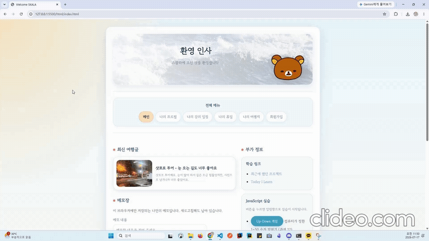

# SKALA Front-End Assignment

HTML, CSS, JavaScript 수업에서 진행한 실습 과제를 정리하는 저장소입니다.  
각 단원의 요구사항을 순서대로 구현하고, 최종적으로 하나의 개인 포털 형태로 통합할 예정입니다.

## Project Goal

- HTML 시맨틱 태그를 활용한 페이지 구조 작성
- CSS를 활용한 공통 디자인 및 반응형 레이아웃 구현
- JavaScript를 활용한 DOM 조작과 사용자 상호작용 구현
- Git 브랜치와 커밋을 활용한 작업 과정 관리

## Tech Stack

- HTML5
- CSS3
- Vanilla JavaScript
- Git / GitHub

## 시연 영상


## Project Structure

```text
SKALA-FRONT/
├─ README.md
├─ html/
│  ├─ index.html
│  ├─ myProfile.html
│  ├─ myClass.html
│  ├─ myHoliday.html
│  ├─ myTrip.html
│  ├─ signUp.html
│  └─ signUpResult.html
├─ css/
│  └─ style.css
├─ script/
│  ├─ nav.js            # 전체 메뉴 (모든 페이지 공통)
│  ├─ memo.js           # 메모장 (index)
│  ├─ upDown.js         # 과제 12. Up-Down 게임
│  ├─ grade.js          # 과제 13. 성적 계산기
│  ├─ bag.js            # 과제 14. 내 가방 보기
│  ├─ weatherAPI.js     # 과제 17. 날씨 데이터 모듈 (export)
│  ├─ realtimeInfo.js   # 과제 17. 화면 처리 모듈 (import)
│  └─ signUpResult.js   # 회원가입 결과 표시
└─ media/
   └─ 이미지, 오디오, 비디오 파일


```

> 실제 파일 구조는 과제 진행 과정에서 변경될 수 있습니다.

## 공통 메뉴 구현 방식

과제 8의 `<nav>`(전체 메뉴)는 모든 페이지에 똑같이 떠야 하므로, HTML을 7개 파일에 복사하는 대신
`script/nav.js`가 공통으로 삽입하도록 구현했습니다.

- 각 페이지에는 자리 표시자 `<nav id="site-nav">`만 두고, `nav.js`가 이 자리를 생성한 `<nav>`로 교체합니다.
- 메뉴 항목은 `nav.js`의 `MENU` 배열 한 곳에서만 관리합니다. 페이지를 추가할 때 이 배열만 수정하면 됩니다.
- 현재 보고 있는 페이지는 링크 대신 `<span aria-current="page">`로 표시됩니다.
- `index.html`의 자리 표시자에는 메뉴 내용을 미리 채워두어, JavaScript가 동작하지 않는 환경에서도 메뉴가 보입니다.

## Run

별도의 빌드 과정은 필요하지 않습니다.

1. 저장소를 Clone합니다.
2. VS Code에서 프로젝트를 엽니다.
3. Live Server로 `html/index.html`을 실행합니다.

```bash
git clone <repository-url>
cd SKALA-FRONT
```

## Commit Convention

```text
feat: 새로운 페이지 또는 기능 추가
style: CSS 및 화면 디자인 수정
fix: 오류 수정
refactor: 코드 구조 개선
docs: README 등 문서 수정
```